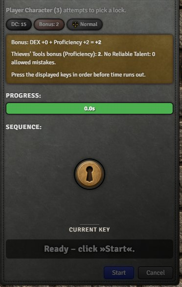
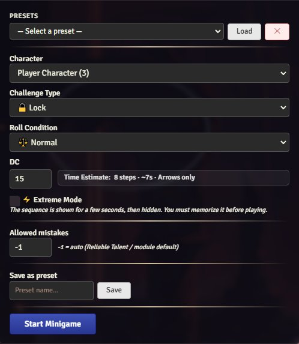
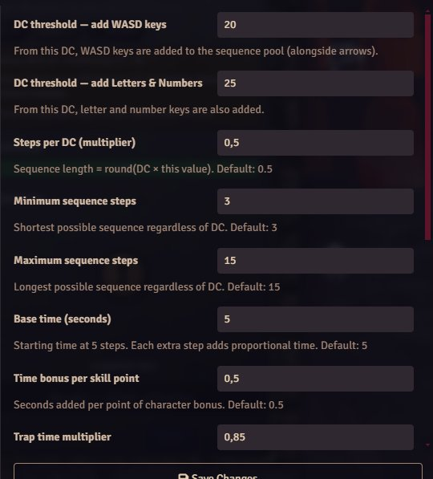

# 🔑 The Lockpicker

An interactive lockpicking and trap disarming minigame for **Foundry VTT**, optimized for **Dungeons & Dragons 5e**.

This module replaces the simple skill check with an engaging, real-time challenge where the player must press the correct keys in sequence before time runs out. Difficulty, timing, and key complexity all scale dynamically with the character's abilities and the GM's configuration.

---

## ✨ Features

### 🎮 Minigame
- **Lockpicking & Trap Disarming** — two challenge types with distinct consequences on failure
- **Real-time key sequence** — press arrow keys (and optionally WASD, letters, numbers) in the correct order before the timer runs out
- **Progressive difficulty** — key pool expands automatically based on DC thresholds set in module settings
- **GM/Spectator mode** — the GM and other players see the minigame in real time via socket sync

### ⚙️ GM Configuration
- **Character selector** — choose which player and character receives the challenge
- **Challenge Type** — Lock (no consequence) or Trap (damage on failure)
- **Roll Condition** — Normal / Advantage (more time) / Disadvantage (less time)
- **DC** — sets sequence length and time available, with a live **Time Estimate** preview
- **⚡ Extreme Mode** — sequence is shown for a configurable number of seconds, then hidden. Player must memorize it before playing
- **Allowed Mistakes** — set a fixed number of allowed mistakes per challenge, or use `-1` for automatic calculation via Reliable Talent
- **Presets** — save and load frequently used configurations with a name
- **Trap settings** — configure damage formula (e.g. `2d6`) and damage type (poison, fire, cold…). Damage is rolled and applied automatically on failure

### 📊 Module Settings
All gameplay parameters are fully configurable:

| Setting | Default | Description |
|---|---|---|
| DC threshold — add WASD keys | 15 | From this DC, WASD is added to the key pool |
| DC threshold — add Letters & Numbers | 20 | From this DC, extra keys are added |
| Steps per DC (multiplier) | 0.5 | Sequence length = round(DC × value) |
| Minimum sequence steps | 3 | Shortest possible sequence |
| Maximum sequence steps | 15 | Longest possible sequence |
| Base time (seconds) | 5 | Starting time at 5 steps |
| Time bonus per skill point | 0.5 | Seconds added per bonus point |
| Trap time multiplier | 0.85 | Time reduction for traps |
| Disadvantage time multiplier | 0.6 | Time reduction with disadvantage |
| Advantage time multiplier | 1.4 | Time increase with advantage |
| Reliable Talent mistakes divisor | 2 | Allowed mistakes = training bonus ÷ this |
| Extreme Mode — memorization time | 3 | Seconds to memorize the sequence |
| Default allowed mistakes | 0 | Fixed mistakes override (0 = use Reliable Talent) |

---

## 📸 Screenshots

### Minigame Window


### GM Configuration


### Module Settings


---

## ⬇️ Installation

### Module ID: `the-lockpicker`

1. Open the Foundry VTT Setup screen
2. Go to **Install Module**
3. Paste the Manifest URL:

```
https://raw.githubusercontent.com/Mariux22/the-lockpicker/main/module.json
```

4. Click **Install** and activate the module in your World Settings

---

## 🕹️ How to Play

### For Players
1. Open your character sheet
2. Find your **Thieves' Tools** in the inventory — a 🔒 icon will appear next to it
3. Click the icon to send a challenge request to the GM
4. When the GM approves, the minigame window opens
5. Press **Start** when ready and follow the key sequence before time runs out

### For the GM
1. Click the 🔒 **lock icon** in the left sidebar to open the configuration window directly
2. Or wait for a player request — a notification will appear automatically
3. Configure the challenge type, DC, roll condition and any other options
4. Click **Start Minigame** — the player receives the challenge and spectators see it in real time

---

## 🎲 D&D 5e Integration

- **DEX modifier** and **Thieves' Tools proficiency** (none / proficiency / expertise) are read automatically from the character sheet
- **Reliable Talent** (Rogue feature) grants allowed mistakes equal to half the training bonus
- **Advantage / Disadvantage** adjusts total time available
- **Trap damage** is rolled as a proper dice roll and applied directly to the character's HP on failure

---

## 🤝 Credits

- **Author:** Mariux22
- **System:** D&D 5e (`dnd5e`)
- **Foundry VTT:** v13+ (verified 13.351)
- **AI Assistance:** Claude — Anthropic (code, structure, logic & debugging)
- **License:** MIT
